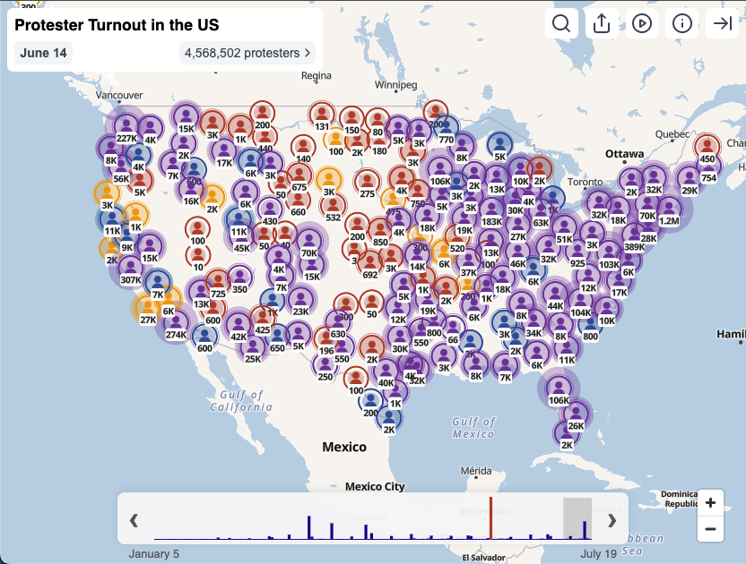

# US Protest Event Map

This project displays recent and planned US protest locations over time on an interactive map, using data provided by We (the People) Dissent. Locations are colored to indicate the 2024 Trump or Harris voting margin for their surrounding precinct.



## Project Overview

The project has two main components:

1.  **Data Scraper (`scripts/scrapeAllTabs.js`):**
    *   This Node.js script fetches event data from a Google Sheet maintained by the volunteer organization [We (the People) Dissent](https://docs.google.com/spreadsheets/d/1f-30Rsg6N_ONQAulO-yVXTKpZxXchRRB2kD3Zhkpe_A/preview#gid=1269890748).
    *   It augments this event data with:
        *   Geocoding information for event locations.
        *   Relevant Wikipedia data for the cities.
        *   Voting precinct margin data from a dataset published by The New York Times.
    *   The script outputs a consolidated `static/data/data.json` file (with an `updatedAt` timestamp), ensuring dates for events are normalized to `YYYY-MM-DD` format.
    *   It supports a `--use-cache` option to use a locally cached version of the raw event data (`cache/events_raw.json`). This cached file itself contains a `scrapedAt` timestamp indicating when its contents were fetched. If the cache is used, the `updatedAt` timestamp in the final `static/data/data.json` will reflect this `scrapedAt` time.
    * It also caches geocoding results for events from [Nominatim](https://nominatim.openstreetmap.org), and geolocated image and title data from [Wikipedia](https://wikipedia.org). 
2.  **SvelteKit Application (Static Site):**
    *   A static SvelteKit application located in the `src` directory consumes the `static/data/data.json` file.
    *   It provides an interactive map interface where users can:
        *   View protest events over a timeline.
        *   Play an animation of events occurring day by day.
        *   Manually select dates using a histogram slider or arrow keys.
        *   Filter events by name.
        *   View details about event locations and their political leaning based on 2024 voting margins.

## Data Sources

*   **Event Locations:** [We (the People) Dissent](https://docs.google.com/spreadsheets/d/1f-30Rsg6N_ONQAulO-yVXTKpZxXchRRB2kD3Zhkpe_A/preview#gid=1269890748)
*   **Voting Precinct Margins:** [The New York Times (GitHub)](https://github.com/nytimes/presidential-precinct-map-2024)
*   **Geocoding:**  [Nominatim](https://nominatim.openstreetmap.org) 
*   **Place Titles and Images:** [Wikipedia](https://wikipedia.org)

## Installation

**NOTE**: This repo uses [Git Large File Storage (LFS)](https://git-lfs.github.com/). (one of its files exceeds the 100Mb GitHub limit)

Install it before cloning:

```bash
brew install git-lfs        # macOS
sudo apt install git-lfs    # Debian/Ubuntu

git lfs install
```

Then clone:
```
git clone https://github.com/concerned-us-citizen/protest-map.git
```

## Development

1.  **Install Dependencies:**
    ```bash
    npm install --legacy-peer-deps # needed to use eslint-plugin-deprecation with eslint 9
    ```

2.  **Generate Data:**
    *   To perform a live scrape and generate `static/data/data.json`:
        ```bash
        node scripts/scrapeAllTabs.js
        ```
    *   To use cached raw data (if `cache/events_raw.json` exists) for faster processing:
        ```bash
        node scripts/scrapeAllTabs.js --use-cache
        ```

3.  **Run SvelteKit Dev Server:**
    ```bash
    npm run dev
    ```
    Or to open in a browser automatically:
    ```bash
    npm run dev -- --open
    ```

## Building for Production

1.  **Ensure Data is Up-to-Date:** Run the scraper script (step 2 in Development) to generate the latest `static/data/data.json`.
2.  **Build the SvelteKit App:**
    ```bash
    npm run build
    ```
    This will create a production version of your app in the `build` directory (or as configured by your SvelteKit adapter).

3.  **Preview the Production Build:**
    ```bash
    npm run preview
    ```

## Deployment

This project is configured as a static site using `adapter-static`. After running `npm run build`, the contents of the build output directory (often `build/`) can be deployed to any static hosting provider (e.g., Vercel, Netlify, GitHub Pages).

## Updating Deployed Data

To update the live application with fresh data, the following steps are necessary:

1.  **Scrape New Data:** Run the scraper script to fetch the latest event information. This will update the `static/data/data.json` file. It's recommended to run a live scrape to ensure data freshness:
    ```bash
    node scripts/scrapeAllTabs.js
    ```
2.  **Rebuild the Application:** Because the main page is prerendered (`export const prerender = true;` in `src/routes/+page.ts`), the data from `static/data/data.json` is fetched and embedded into the static HTML files during the build process. Therefore, to incorporate the new data into the served pages, the SvelteKit application must be rebuilt:
    ```bash
    npm run build
    ```
3.  **Redeploy:** Deploy the entire contents of the updated build directory (e.g., `build/`) to your static hosting provider. The exact steps will depend on your hosting service (e.g., push to a specific branch for Vercel/Netlify, manually upload files, etc.).

This process ensures that the prerendered static site served to users contains the most recently scraped and processed event data. Simply updating the `data.json` file on the server without rebuilding will not update the initial content seen by users for prerendered pages.
